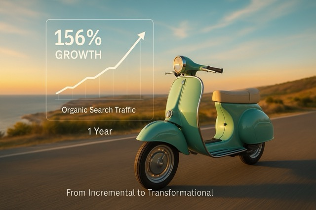

# AI-Driven Content Strategy Boosts Tourism Performance

**Source:** https://www.edge8.ai/post/ai-driven-content-strategy-vespa
**Categories:** AI in Business | AI Strategy | Revenue

---

In today's competitive business landscape, AI implementation is no longer merely an option for forward-thinking organizations. It's becoming a critical differentiator between market leaders and followers. At Edge8.ai, we've observed a clear correlation between strategic AI adoption and exceptional business performance across multiple sectors.

A recent case study from our tourism industry portfolio provides compelling evidence of this correlation, demonstrating how properly implemented AI solutions can drive performance that substantially outpaces industry benchmarks.

---

## Executive Summary

Working with a mid-market tourism enterprise, our team implemented an AI-driven content and analytics strategy that delivered remarkable results within a 12-month period:

- **30% revenue growth** in a market averaging 8% expansion
- **156% increase** in organic search traffic
- Significant improvements in conversion rates across multiple channels
- Enhanced operational efficiency through automated content optimization

These outcomes were achieved through a focused implementation that emphasized strategic alignment, data-driven decision-making, and cross-functional AI integration.

---

## The Strategic Challenge

The client — a boutique adventure tourism operator — faced challenges common to mid-market tourism businesses:

- Content production was slow and inconsistent, making it difficult to maintain search visibility
- Marketing was reactive rather than strategic, responding to demand signals rather than creating them
- Customer journey data existed but wasn't being used to improve conversion rates
- The team had the expertise and experience to compete with larger operators but lacked the content infrastructure to surface that expertise at scale

The core insight driving our approach: the competitive advantage existed in the client's authentic expertise and unique access. The gap was in content infrastructure that could surface and distribute that expertise effectively.

---

## The AI-Driven Content Implementation

**Phase 1: Content Architecture (Months 1-2)**

We began with comprehensive keyword and competitive analysis using AI-powered SEO tools. This revealed specific topic clusters where the client had genuine expertise but minimal online presence — high-value gaps that competitors weren't filling.

AI tools then generated content briefs for 60+ articles targeting these topic clusters, structured around the client's actual experience and customer questions.

**Phase 2: Content Production at Scale (Months 2-6)**

Using AI to draft initial content based on structured briefs, then editing with the client's authentic voice and experience, we produced 3-4 high-quality articles per week — a pace that would have been impossible with traditional content production methods.

Each piece of content was optimized for search intent, user experience, and conversion — with AI tools analyzing performance data from previous articles to inform each new piece.

**Phase 3: Conversion Optimization (Months 4-9)**

AI analysis of customer journey data revealed specific friction points where potential customers were dropping off. A/B testing of landing pages, booking flows, and email sequences — guided by AI analysis — drove systematic conversion improvement.

**Phase 4: Automated Content Maintenance (Months 6-12)**

AI monitoring tools tracked ranking changes, identified content decay, and triggered content updates automatically. This kept existing high-performing content fresh without requiring manual monitoring.

---

## Key Lessons for Tourism and Hospitality Leaders

**1. Authentic expertise is the raw material; AI is the amplifier**
The content that performed best combined AI's structural and SEO intelligence with the client's genuine expertise. Generic AI-produced content underperformed. Expert-informed AI content dramatically outperformed.

**2. Consistency compounds**
The 156% traffic growth didn't happen from a few viral pieces. It accumulated from 60+ pieces of consistent, high-quality content that built topical authority over time. AI made this consistency achievable for a small team.

**3. Data integration unlocks the full value**
Connecting content performance to booking data enabled optimization decisions that pure content metrics couldn't support. The revenue growth came from understanding how content contributed to the booking journey, not just how it ranked.

[Contact Edge8](https://www.edge8.ai/contact) to explore AI-driven content strategy for your tourism or hospitality business.
