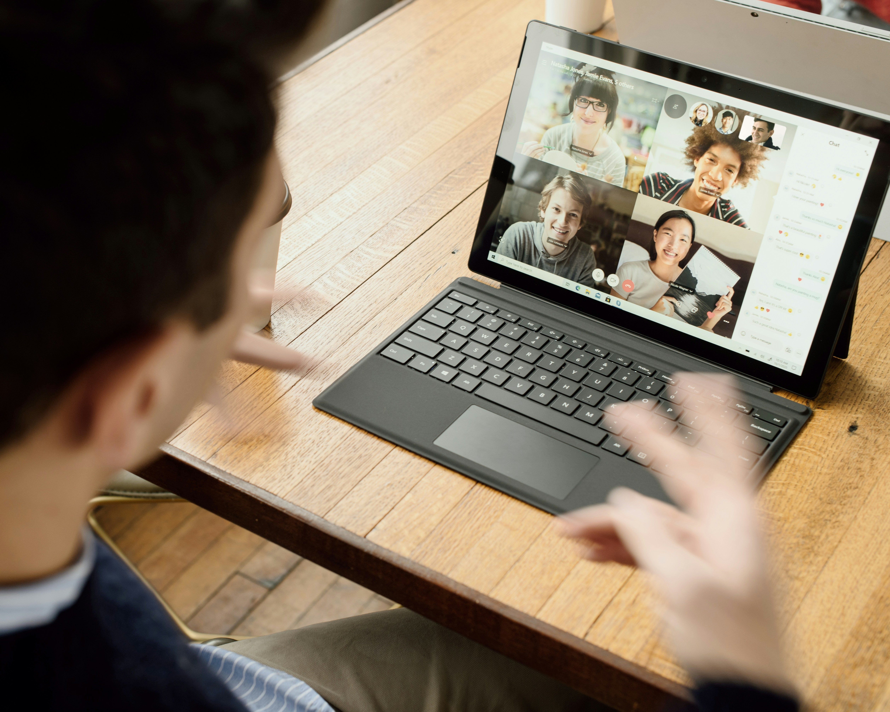

# How AI Agents Are Powering Remote & Hybrid Marketing Teams

**Source:** https://www.edge8.ai/post/ai-in-remote-hybrid-marketing-teams
**Categories:** AI in Business | Operations | AI Strategy

---

The shift to remote and hybrid work has fundamentally changed how marketing teams operate. Traditional methods of brainstorming, collaboration, and campaign execution no longer fit the fast-paced digital landscape. AI Agents have emerged as the ultimate co-pilots for remote marketing teams, optimizing workflows, automating decision-making, and streamlining creative processes.

From AI-powered content creation to marketing automation, businesses leveraging AI tools are not just adapting — they're thriving. This article explores how AI is reshaping remote marketing teams, ensuring they remain agile, efficient, and ahead of the competition.

---

## AI for Remote Team Collaboration & Productivity

One of the biggest challenges remote marketing teams face is maintaining seamless collaboration. AI-powered tools are bridging the gap, ensuring smooth workflows and enhanced communication, regardless of location.

AI assists in project management and workflow automation, handling everything from task allocation to campaign tracking. Instead of juggling spreadsheets and endless email threads, marketing teams can rely on AI-driven automation to keep projects on track.

Even meetings — often seen as a necessary evil — are becoming AI-enhanced experiences. AI can transcribe, summarize, and analyze conversations, extracting actionable insights that prevent information from being lost in endless discussions. This ensures meetings are not just routine check-ins but data-driven strategy sessions that move teams forward.

By integrating AI tools, remote teams no longer feel disconnected or overwhelmed; instead, they operate with efficiency, clarity, and focus.

---

## AI-Powered Content Creation for Distributed Teams

Creating consistent, high-quality content across distributed teams has historically been one of the hardest remote work challenges. Inconsistent brand voice, delayed review cycles, and coordination overhead compound into significant productivity losses.

AI transforms this dynamic:

**Consistent brand voice at scale** — AI trained on brand guidelines produces first drafts that maintain voice consistency regardless of which team member is involved. Reviewers spend time on substance, not style corrections.

**Asynchronous content workflows** — AI can complete content creation tasks when human team members are offline, enabling 24/7 production cycles across global teams without requiring night-shift work.

**Automated briefing and asset management** — AI can intake a campaign brief, break it into individual content tasks, assign appropriate templates, and track completion — reducing coordination overhead that typically falls on team leads.

---

## AI-Driven Campaign Management Across Time Zones

Managing campaigns across time zones requires real-time intelligence that human teams can't sustain. AI bridges the gap:

- **Real-time performance monitoring** — AI tracks campaign metrics continuously and surfaces underperformance before it compounds
- **Automated optimization** — budget reallocation, bid adjustments, and audience refinements can run autonomously within defined parameters
- **Anomaly detection** — AI flags unusual patterns (traffic spikes, conversion drops, competitor activity) for human review
- **Cross-market adaptation** — AI can adapt campaign messaging for regional markets while maintaining strategic coherence

The result: campaigns that are actively optimized around the clock, not just during business hours.

---

## Building Your Remote AI Marketing Stack

The most effective AI-powered remote marketing teams share a common characteristic: they treat their AI tools as a system, not a collection of point solutions.

A coherent AI marketing stack for remote teams includes:

1. **Central knowledge repository** — where brand assets, guidelines, and campaign history live, accessible to AI tools for context
2. **Workflow automation layer** — connecting tools and automating handoffs between tasks
3. **Performance intelligence layer** — AI analytics that surface actionable insights across all channels
4. **Communication intelligence** — meeting summaries, async briefing tools, and decision documentation

Teams that invest in connecting these layers see compounding returns as each tool becomes more effective with access to the others' context.

---

## FAQs

**How do AI Agents improve collaboration in remote marketing teams?**
AI streamlines workflows, automates communication, and enhances meeting productivity, ensuring remote teams stay aligned and efficient.

**Can AI replace human creativity in marketing?**
No. AI enhances creativity by providing data-driven insights, automating repetitive tasks, and freeing up time for marketers to focus on strategic storytelling.

**What are the biggest AI-driven trends in digital marketing?**
Key trends include hyper-personalization at scale, AI-powered predictive analytics, real-time customer engagement, and increased automation in content and ad optimization.

[Contact Edge8](https://www.edge8.ai/contact) to build your AI-powered remote marketing capability.
