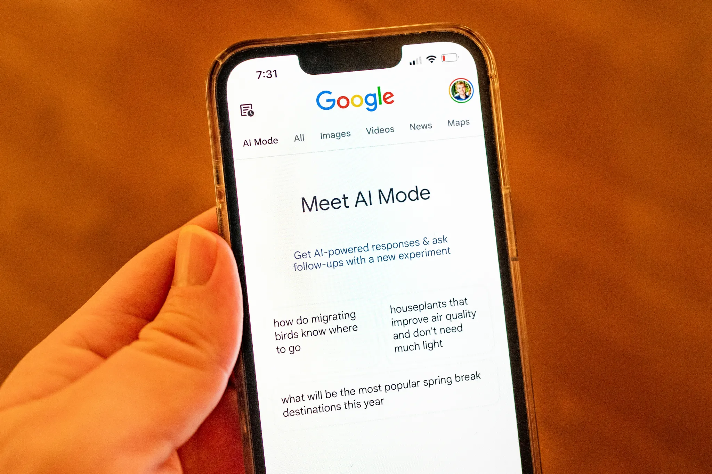

# AI Search Optimization: Adapting to Google's Traffic Revolution

**Source:** https://www.edge8.ai/post/ai-search-optimization-google-traffic-revolution
**Categories:** AI in Business | SEO | Marketing

---

The digital marketing landscape is experiencing its most significant disruption since the advent of mobile-first indexing. Google's AI Overviews and conversational search features are fundamentally altering how users discover and consume content, creating an existential crisis for businesses that have built their marketing strategies around traditional organic search traffic.

Recent data reveals the stark reality facing content creators and businesses alike. The New York Times saw its organic search traffic share drop from 44% to 36.5% in just three years — a decline that mirrors what's happening across the publishing and business content landscape. This isn't just a media problem. It's a wake-up call for every business that depends on search visibility for lead generation and brand awareness.

---

## The AI Search Optimization Revolution Is Here

Google's AI Overviews represent more than a feature update; they're a fundamental shift in how search results are delivered. When users can receive comprehensive answers directly in search results, the incentive to click through to original sources diminishes dramatically. This change affects not just news publishers but any business creating educational content, product reviews, how-to guides, or industry insights.

The introduction of AI Mode — Google's ChatGPT competitor — promises to accelerate this trend. Unlike traditional search results that provide multiple blue links, AI Mode offers conversational responses with fewer external references. For businesses accustomed to capturing traffic through informational content, this represents a seismic shift in user behavior and traffic patterns.

---

## Beyond Traditional SEO: The New Marketing Reality

Smart businesses must Be Tech-Forward in their approach to this challenge. The era of simply optimizing for keywords and hoping for organic traffic is evolving into something more complex and strategic. Companies need to rethink their entire content and distribution strategy, moving beyond reliance on Google's algorithm changes to building direct relationships with their audiences.

This transformation demands a multi-channel approach that doesn't depend solely on search engine referrals. Businesses that thrive in this new environment will be those that:

- **Diversify traffic sources** — email lists, direct communities, social media, and partnerships
- **Build owned audiences** — subscribers who come directly, bypassing search entirely
- **Create AIO-optimized content** — structured for AI Overview citation, not just ranking
- **Develop authoritative brand signals** — content that AI systems recognize as trustworthy sources

---

## Strategic Adaptation: The Marketing Framework for AI Search

The organizations successfully navigating this transition share a common strategic framework:

**1. Become citation-worthy**
AI Overviews cite sources they consider authoritative. Focus on becoming a recognized expert in narrow, specific topics rather than trying to rank for broad terms. Original research, unique data, and expert perspectives get cited; generic summaries do not.

**2. Build direct relationships aggressively**
Every visitor who arrives from search is a potential direct subscriber. Convert them with genuine value — free tools, exclusive insights, community access — before search traffic disappears. Email lists and direct communities are search-algorithm-proof.

**3. Optimize for AI conversation, not keyword density**
Content structured for conversational AI queries performs better in AI-mediated search. Write comprehensive answers to specific questions. Use clear headers. Define terms explicitly. Think like the person asking, not the algorithm ranking.

**4. Invest in brand search**
When people search your company name directly, you capture 100% of that traffic regardless of AI Overview changes. Building brand recognition is the most durable SEO strategy in an AI search world.

---

## The Competitive Window Is Closing

Most businesses are still optimizing for yesterday's search landscape. This creates a temporary window for organizations willing to adapt now. The businesses that build AI-search-resilient marketing strategies today will maintain visibility and influence as competitors struggle with declining organic traffic.

The question isn't whether to adapt to AI search optimization — it's whether you adapt before or after your competitors. [Contact Edge8](https://www.edge8.ai/contact) to develop an AI-era search and visibility strategy for your business.
