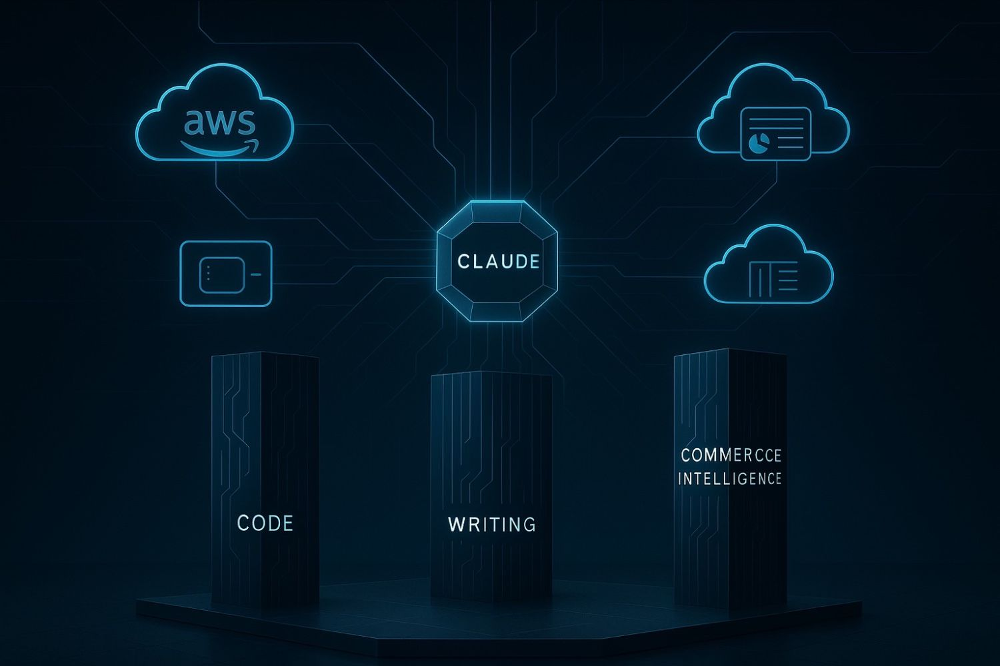

# How Amazon's $4B Investment Powers Claude AI Dominance

**Source:** https://www.edge8.ai/post/amazon-claude-ai-dominance-strategy
**Categories:** AI in Business | AI Strategy | Technology

---

When Amazon invested $4 billion in Anthropic, most analysts focused on the funding amount. They missed the real story: Amazon didn't just write a check — they secured access to the most comprehensive dataset for building domain-specific AI supremacy. This strategic move positions Claude to dominate three critical AI battlegrounds: coding, writing, and commerce intelligence.

The AI revolution has shifted from building the best general models to controlling the most irreplaceable data sources. While competitors scramble for training data, Amazon already owns the infrastructure where the world's software lives, the marketplace where humanity shops, and access to the largest collection of human knowledge ever assembled.

---

## The Data Empire Behind Claude's Advantage

**AWS: The Coding Intelligence Foundation**

Amazon Web Services hosts over 30% of the internet's infrastructure, creating an unprecedented view into how software actually gets built, deployed, and maintained at scale. Every debugging session, every architectural decision, every scaling challenge flows through AWS systems.

This isn't theoretical coding knowledge — it's the reality of how modern software development actually works. Claude's coding assistance benefits from exposure to real-world infrastructure patterns, deployment challenges, and debugging scenarios that no academic dataset can replicate.

**Amazon Retail: Commerce Intelligence at Scale**

Amazon's retail empire processes over 12 billion transactions annually, revealing the authentic patterns of human decision-making. Not what people say they want in surveys, but what they actually purchase when spending their own money.

This commerce intelligence creates AI that understands buyer psychology, product positioning, and conversion optimization from the world's largest real-world experiment in commerce.

**Publishing: The World's Organized Knowledge**

The writing advantage comes from Amazon's position as the world's largest bookstore and publishing platform. Through Kindle Direct Publishing and traditional book sales, Amazon has access to millions of structured human thoughts across every conceivable topic — professionally edited and organized across centuries of human insight.

---

## Why Claude's Domain Specialization Beats General Intelligence

The future of AI won't be dominated by one model that does everything adequately. Instead, we'll see specialized AI systems that excel in specific domains where they have irreplaceable data advantages.

Claude's three core domain advantages:

1. **Coding excellence** — real AWS deployment patterns, not just syntax
2. **Writing quality** — trained on professionally edited books, not just web text
3. **Commerce understanding** — 12B+ real transactions reveal true human decision-making

Companies pursuing AI for specific high-value use cases increasingly find that Claude's domain depth outperforms general models for their most important applications.

---

## Strategic Implications for Organizations

For businesses evaluating their AI stack:

**Choose based on your primary use case:**
- Heavy coding/development workflows → Claude's AWS-informed coding assistance offers genuine advantages
- Content and writing at scale → Claude's publishing-trained writing quality shows in output
- Commerce and customer decision-making → Claude's commerce intelligence is uniquely valuable for retail and e-commerce applications

**Think about data flywheel positioning:**
Organizations using Claude for business tasks contribute anonymized usage data that continues improving Claude's domain expertise. Early adopters in key domains benefit from the most rapid improvement cycles.

**Consider the strategic ecosystem:**
Amazon's investment means Claude will be deeply integrated into AWS infrastructure, making it the natural choice for AWS-native organizations. If your infrastructure is AWS-based, Claude's integration advantages will compound over time.

The broader lesson: the AI model that will dominate your industry isn't necessarily the most capable model overall — it's the model with the deepest understanding of your specific domain. [Contact Edge8](https://www.edge8.ai/contact) to identify which AI models offer the strongest strategic fit for your business context.
