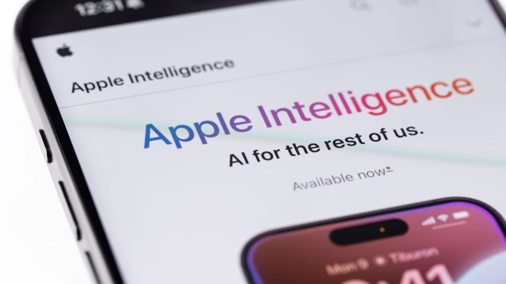

# How Apple Intelligence Shapes Personal AI Strategy

**Source:** https://www.edge8.ai/post/apple-intelligence-intimate-personal-ai-strategy
**Categories:** AI in Business | AI Strategy | Data Privacy

---

While competitors race to accumulate massive datasets in the cloud, Apple has chosen a fundamentally different path for AI dominance. Through Apple Intelligence, the company is building the most trusted and personalized AI experience by processing intimate personal data directly on-device, creating unprecedented understanding of individual users while maintaining absolute privacy control.

This isn't just about privacy as a feature — it's about leveraging privacy as a **strategic moat** to access the most valuable and irreplaceable dataset in technology: authentic human behavior patterns, health insights, and decision-making preferences that users would never share with cloud-based systems.

---

## The Intimate Data Advantage

Apple's ecosystem captures the most personal aspects of human behavior through seamless integration across iPhone, Mac, Apple Watch, and other devices. Every tap, swipe, health measurement, location pattern, communication habit, and purchase decision creates a comprehensive portrait of individual preferences and needs.

This intimate device behavior data reveals authentic patterns that surveys and external observations cannot capture:
- How people actually spend their time
- What content they engage with privately
- How health metrics correlate with productivity and mood
- What triggers purchasing decisions

All of this is processed securely on the device itself — never transmitted to external servers.

The health and wellness dimension adds another irreplaceable layer. Through Apple Watch and health app integrations, Apple accesses biometric data and lifestyle patterns that provide insights into human performance, stress responses, sleep quality, and physical activity preferences that no cloud-based competitor can replicate.

---

## Why Apple Intelligence Succeeds Through Privacy-First Architecture

Traditional AI systems require sending personal data to remote servers for processing, creating fundamental trust barriers with users. Apple Intelligence eliminates this friction by performing all personal AI processing directly on the user's device, using the advanced Neural Engine in Apple silicon.

This on-device approach enables deeper personalization than cloud-based systems because **users feel safe sharing more intimate information when they know it never leaves their device.** The result is AI that understands context, preferences, and needs at a granular level that competitors simply cannot achieve.

Companies that stay Tech-Forward understand this shift: the future of AI isn't just about processing power or algorithm sophistication — it's about trust and the willingness of users to share authentic behavioral data. Apple's privacy-first architecture removes the barriers that limit other AI systems' access to truly personal insights.

---

## The Irreplaceable Nature of Trust and Integration

Apple's competitive advantages in personal AI stem from factors that competitors cannot easily replicate. The deep hardware-software integration required for effective on-device AI processing represents years of coordinated development across chip design, operating systems, and application frameworks.

More fundamentally, Apple's brand positioning around privacy and premium experiences creates user trust that enables access to intimate personal data. This trust — built over decades of consistent privacy practices — cannot be quickly established by competitors seeking to enter the personal AI space.

The ecosystem lock-in effect amplifies these advantages. As Apple Intelligence becomes more personalized and valuable, users become increasingly reluctant to switch to competing platforms that would require rebuilding their AI relationship from scratch.

---

## What This Means for Your Business AI Strategy

Apple's approach offers a powerful strategic lesson: **the most defensible data advantages often come from what you promise users, not just what you collect.**

Organizations building AI strategies should consider:

- **Trust as infrastructure** — users share more authentic data when they trust how it's used
- **On-device processing** where possible reduces compliance risk while increasing user comfort
- **Behavioral data beats survey data** — what people actually do is more valuable than what they say they do
- **Ecosystem integration compounds** — AI that connects across your tools becomes more valuable than standalone applications

The companies that build AI systems users genuinely trust will access deeper, more authentic behavioral signals than those competing purely on technical capability. [Contact Edge8](https://www.edge8.ai/contact) to explore how trust-centered AI design can create competitive advantages for your organization.
