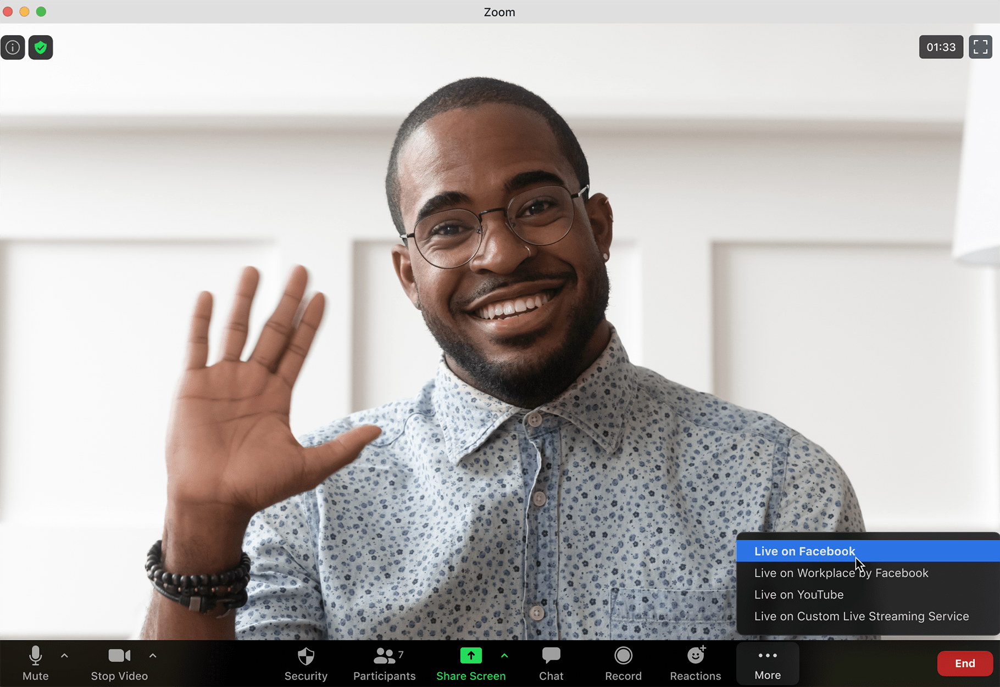

# Boost Your Business with an AI-Driven Landing Page Strategy

**Source:** https://www.edge8.ai/post/boost-your-business-with-an-ai-driven-landing-page-strategy
**Categories:** AI in Business | Revenue | Operations

---

A client interview transcript does more than just convey facts — it brings authenticity and emotional resonance. When your landing page shares real experiences and direct quotes, it paints a clearer picture of what working with you truly looks like. You're not just marketing; you're storytelling through the voice of someone who's already walked the path.

This approach also keeps the focus where it belongs: on real people and their transformations, not just features and tech jargon. You're making it easier for potential clients to see themselves in the success story.

---

## Why Client Conversations Are Your Best Landing Page Material

The most effective landing pages answer a single question better than any competitor: "What will my life look like after working with you?"

Client interviews answer this question with evidence, not claims. When a real client describes their transformation in their own words, it accomplishes several things simultaneously:
- Provides social proof that claimed benefits are real
- Uses the language your ideal prospects use to describe their problems (which builds SEO value and emotional resonance)
- Creates narrative arc — before, after, what changed — that drives conversion
- Builds trust through specificity that marketing copy can't achieve

The challenge has always been extracting this value without investing hours in manual processing. AI changes the economics completely.

---

## How AI Agents Transform Interview Transcripts into Landing Page Content

Let's be honest — digging through long interviews isn't the best use of your time. That's where your AI agent steps in. With smart transcription and segmentation tools, AI can:

- Transcribe a 30-minute call in minutes
- Identify key moments and emotional highlights
- Organize themes and insights for quick use
- Extract specific quotes that demonstrate value

You're free to focus on strategy and storytelling, while AI does the heavy lifting behind the scenes.

---

## The AI Landing Page Creation Workflow

**Step 1: Conduct Structured Client Interviews**

The quality of your landing page output depends on the quality of your interview input. Structure interviews to surface:
- The specific problem the client was experiencing before working with you
- What they tried that didn't work
- The moment they realized the approach was working
- Specific, quantifiable outcomes where possible
- What they would tell a friend considering the same decision

**Step 2: Process Transcripts with AI**

Upload interview transcripts to an AI tool with a structured extraction prompt. Ask AI to:
- Identify the three most compelling "before" statements
- Extract the clearest "after" outcomes
- Surface quotes that would resonate with your target audience
- Organize themes across multiple interviews

**Step 3: Generate Landing Page Structure**

AI can draft landing page structure based on extracted insights:
- Headline that uses client language to describe the problem
- Hero section that promises the transformation
- Social proof section with curated quotes
- Benefits section grounded in client outcomes
- FAQ section addressing objections surfaced in interviews

**Step 4: Refine for Conversion**

AI's structural output needs human refinement for:
- Emotional punch — AI structures accurately but often understates emotional resonance
- Specificity — adding details that make claims concrete and credible
- Call to action calibration — matching CTA strength to where visitors are in their decision journey

---

## Measuring the Impact

AI-assisted landing pages built from client interview content consistently outperform traditionally written pages on key metrics:

- **Bounce rate** — visitors recognize authentic language and stay
- **Time on page** — story-driven content holds attention longer
- **Conversion rate** — social proof from real clients drives action
- **Ad relevance scores** — authentic language matches search intent better

The businesses building systematic processes for capturing and leveraging client testimonials are creating conversion assets that compound in value as the library grows. [Explore Edge8's AI-Powered Solutions](https://www.edge8.ai/) to transform your client conversations into conversion engines.
