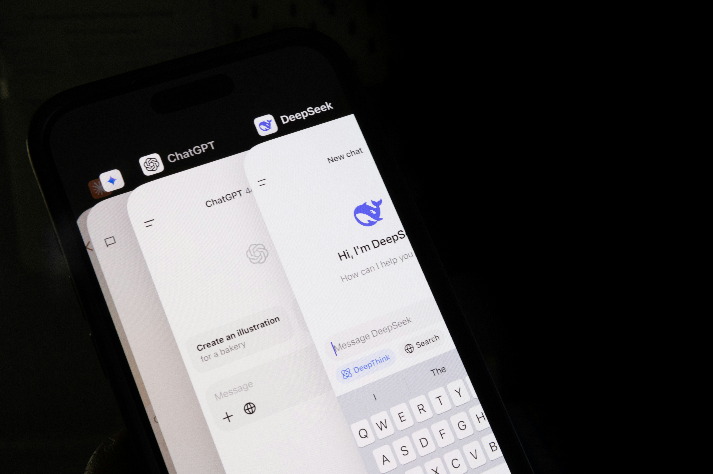

# How ChatGPT Leverages Microsoft's Workplace Data for AI Dominance

**Source:** https://www.edge8.ai/post/chatgpt-billion-user-advantage-general-ai-dominance
**Categories:** AI in Business | AI Strategy | Technology

---

While the AI industry debates specialized versus general-purpose models, ChatGPT has quietly solved the most challenging problem in artificial intelligence: understanding what humans actually want across every conceivable use case. Through its partnership with Microsoft and access to comprehensive workplace data, combined with feedback from over a billion users, ChatGPT has created the most comprehensive dataset of human preferences ever assembled.

This isn't just about user numbers — it's about the strategic advantages that emerge when you combine massive-scale human feedback with Microsoft's unparalleled workplace intelligence.

---

## The Data Empire Behind ChatGPT's General Excellence

ChatGPT's billion-user base represents something unprecedented in technology history: real-time feedback on AI performance across every imaginable task. Every conversation, correction, and preference signal contributes to a continuously improving understanding of human needs and communication patterns.

Microsoft's partnership amplifies this advantage exponentially. Through Office 365, Teams, and LinkedIn, Microsoft captures how three billion people actually work, communicate, and advance their careers. This workplace reality data reveals authentic patterns of professional productivity, collaboration styles, and skill development that no competitor can replicate.

The combination creates a unique form of cross-domain learning. While specialized AI systems excel in narrow domains, ChatGPT learns from use cases spanning:
- Creative writing and content creation
- Technical documentation and coding
- Strategic planning and analysis
- Educational content and tutoring
- Customer service and communication

This diverse exposure enables general-purpose excellence that specialized models cannot achieve.

---

## Why General-Purpose AI Still Matters in a Specialized World

The shift toward AI specialization doesn't eliminate the need for general-purpose intelligence — it makes it more valuable. Organizations need AI that can seamlessly transition between tasks, understand context across domains, and adapt to novel challenges without requiring specialized training.

**The billion-user feedback loop creates compounding advantages:**

1. **Breadth of use cases** — ChatGPT has encountered virtually every type of human-AI interaction, building robust handling for edge cases competitors haven't seen
2. **Real-time preference learning** — user corrections and feedback immediately inform model improvements
3. **Cross-domain pattern recognition** — lessons learned in creative writing improve technical explanations and vice versa
4. **Institutional knowledge** — years of interaction data create behavioral patterns that new entrants cannot quickly replicate

---

## The Microsoft Workplace Intelligence Edge

Microsoft's strategic value extends far beyond funding. Through M365 Copilot integration, ChatGPT gains access to how professionals actually use AI in real work contexts — not sanitized demos or benchmark tests.

This workplace intelligence reveals:
- Which AI suggestions professionals actually use vs. discard
- How AI assistance evolves across different skill levels
- What communication styles resonate in professional contexts
- How AI tools integrate into existing workflow patterns

For enterprise AI applications, this understanding of real professional behavior is irreplaceable. It's the difference between AI that performs well in demos and AI that actually gets used in daily work.

---

## Strategic Implications for Business Leaders

For organizations building their AI strategies, ChatGPT's general excellence creates important considerations:

- **Default to proven general tools** for wide-ranging tasks before investing in specialized solutions
- **Leverage Microsoft integrations** if your organization already uses M365 — the workflow integration advantage is substantial
- **Monitor the specialization/generalization balance** in your specific use cases — some tasks genuinely benefit from specialized models, others from general adaptability
- **Don't underestimate network effects** — tools used by billions of people improve faster than those used by thousands

The future of AI won't be dominated by one model that does everything adequately, nor exclusively by specialized models. Organizations that understand when to use general vs. specialized AI will outperform those locked into either extreme. [Connect with Edge8](https://www.edge8.ai/contact) to develop an AI portfolio strategy tailored to your specific needs.
