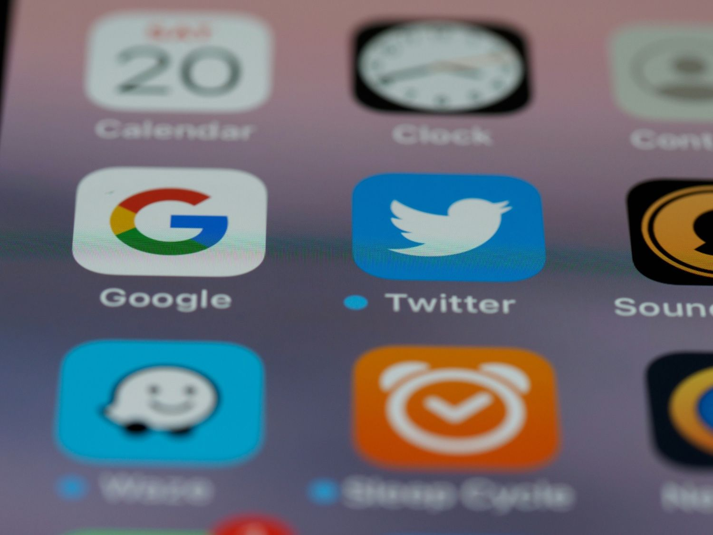

# Elon Musk's Twitter Data Strategy: AI Lessons for Leaders

**Source:** https://www.edge8.ai/post/elon-musk-twitter-data-strategy-ai-play
**Categories:** AI in Business | Data Strategy | AI Leadership

---

When Elon Musk paid $44 billion for Twitter, mainstream commentators framed it as another outsized ego play — an impulsive purchase of a fading social network whose best days were behind it. One year later, the platform is renamed X, its data pipe is owned by xAI, and Grok, Musk's large language model, can pull answers from the public zeitgeist faster than any search engine.

Critics never saw the real strategy: **Musk didn't buy a social platform. He bought the world's largest, human-curated index of the web — a living signal layer that traditional crawlers like Google can't replicate.**

---

## Understanding the Opinion Graph Strategy

Google's core advantage has always been its link graph: trillions of hyperlinks that serve as quiet endorsements for which pages matter. But links are static. They don't tell you why a page matters, whether the sentiment is positive or negative, or how public perception shifts after new information appears.

Twitter, now X, is built on the opposite premise: every post is a live, time-stamped judgment call. When 400 million people share a link, comment, or like, they inject an opinion signal that says *this matters now* — or *this is junk*. Multiply that by billions of interactions per day and you get a constantly refreshed **opinion graph** mapping relevance, trust, and sentiment in real-time.

No crawler, no matter how sophisticated, can keep up with that velocity. Think of each repost as a miniature crowdsourced peer review; each quote tweet as a contextual note in the margin; each like as a micro-vote of confidence. Added together, they form a high-resolution heat map of what the global internet cares about. For an AI model, that heat map is gold.

---

## The Hidden Asset: Web Intelligence at Scale

Inside X's data firehose sits a dual signal most companies never see:

- **Authentic language** — short-form, informal, laced with slang, sarcasm, and cultural nuance
- **Human judgment** — visible endorsements and rejections of every URL, idea, or meme that crosses the timeline

Combine those signals and you gain not just a corpus of text, but a distributed content-quality filter powered by humans. It answers two questions simultaneously:
- "What does this page say?" (traditional NLP)
- "Does the world believe this page is valuable?" (opinion data)

Grok's "deep search" capability is built on precisely that blend. Where legacy engines rank pages by backlinks and on-page SEO, Grok can weight results by the real-time consensus of the most engaged, knowledgeable communities on the internet.

---

## Business Lessons from the Twitter Play

Musk's acquisition offers strategic lessons that extend far beyond AI development:

**1. See assets others can't see**
The $44B price tag looked absurd through the lens of traditional social media metrics. Through the lens of AI training data, it was a bargain. The ability to see unconventional strategic value in existing assets is the rarest and most valuable leadership capability.

**2. Data assets age differently than technology assets**
Technology depreciates. Proprietary data — especially behavioral, opinion, and engagement data — appreciates over time. Organizations building data assets today are creating value that compounds as AI capabilities advance.

**3. Vertical integration creates compounding advantages**
By owning both the data source (X) and the AI system (Grok/xAI), Musk created a flywheel where better data improves the model, which attracts more users, which generates better data. This vertical integration strategy is increasingly the template for AI dominance.

**4. Control the signal layer, not just the content**
The most valuable AI training data isn't raw content — it's signal about which content matters. Organizations that own engagement and quality signals have information advantages that pure content producers cannot match.

---

## What This Means for Your Organization

Most businesses can't buy Twitter. But they can apply the same strategic thinking:

- **Identify your opinion graph equivalents** — what engagement and quality signals does your organization generate or have access to?
- **Build feedback loops** into your AI systems — customer corrections, engagement patterns, and outcome data are your version of the Twitter signal layer
- **Think about data vertical integration** — owning the data source, not just the data, creates more durable advantages
- **Invest in real-time signal collection** — historical data has diminishing returns; behavioral signals from the present are increasingly valuable

[Contact Edge8](https://www.edge8.ai/contact) to explore how data strategy thinking can create AI advantages for your organization.
