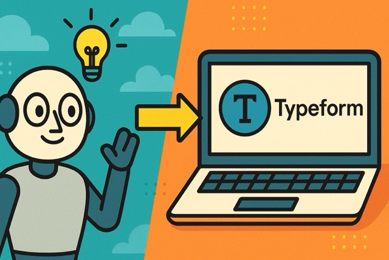

# How to Create Typeform Surveys with AI

**Source:** https://www.edge8.ai/post/how-to-create-typeform-surveys-with-ai
**Categories:** AI in Business | Operations | AI Strategy

---

Want to create Typeform surveys with AI in minutes instead of hours? Here's exactly how to leverage Claude AI to transform a lengthy performance review document into a sleek, user-friendly Typeform survey — complete with workarounds for all the platform's limitations.

Using this AI-assisted approach saved approximately 4-5 hours of manual work. But the real win? Survey completion rates increased 15% compared to the previous format. That's not just efficiency — that's scalable impact.

---

## Why AI-Assisted Survey Design Works

Survey design is a deceptively complex skill. Good surveys:
- Ask questions in the right order to avoid bias
- Use language at the right reading level for the audience
- Balance open-ended and closed questions for the right data mix
- Keep completion time short enough to maintain response rates

Most survey creators focus on content and ignore structure. AI excels at both — and combining AI's structural intelligence with your content expertise produces surveys that perform better than either approach alone.

---

## The Step-by-Step Process

### Step 1: Prepare Your Source Document

Before engaging AI, gather the raw material: the content you want to survey about, existing questions you've used before, the goals of this specific survey, and who will be completing it.

The quality of your source document determines the quality of AI's output. Garbage in, garbage out — but equally, clear source material produces remarkably usable survey structure.

### Step 2: Craft Your AI Prompt

When prompting Claude AI (or similar) to create a Typeform survey, include:
- **Purpose statement** — what this survey is trying to learn
- **Audience description** — who will complete it, their context and relationship to the topic
- **Length constraint** — target completion time (5 minutes, 10 minutes)
- **Format preferences** — question types you want used (multiple choice, rating scale, open text)
- **Typeform-specific constraints** — the platform has specific question type limitations; tell AI to work within them

### Step 3: Review and Refine the Output

AI's first draft will be 70-80% usable. Common refinements needed:
- **Question sequencing** — AI sometimes front-loads difficult questions; move warmer questions earlier
- **Language calibration** — adjust vocabulary to match your specific audience's familiarity with terminology
- **Logic jumps** — Typeform's conditional logic can route respondents through different paths based on answers; AI can suggest the logic, but you'll need to implement it manually

### Step 4: Handle Typeform's Technical Constraints

Typeform has several limitations that require workarounds when implementing AI-generated survey structures:
- Maximum question counts per page
- Limited question types in free tiers
- Conditional logic that only works with certain question types

Having AI explicitly generate a "Typeform implementation notes" section alongside the survey design saves significant back-and-forth during implementation.

---

## Results That Matter

The efficiency gains from AI-assisted survey design compound over time:

- Initial survey creation: 45 minutes vs. 4-5 hours
- Revision cycles: fewer because AI-designed structure is more logical
- Response rates: higher because AI-designed flow is more natural

For teams running regular research programs, this efficiency gain translates into either more research (more insights) or freed capacity for higher-value work. Both outcomes create competitive advantage.

---

## Beyond Surveys: The Broader Principle

The same approach works for any structured document creation: interview guides, assessment frameworks, onboarding checklists, performance review templates. The pattern is always the same — provide clear source material and intent, let AI generate the initial structure, refine for your specific context.

Being Tech-Forward means finding these leverage points where AI can handle the structural heavy lifting, freeing your team for the strategic and relationship-oriented work that actually differentiates your business. [Contact Edge8](https://www.edge8.ai/contact) to explore AI productivity applications for your team.
