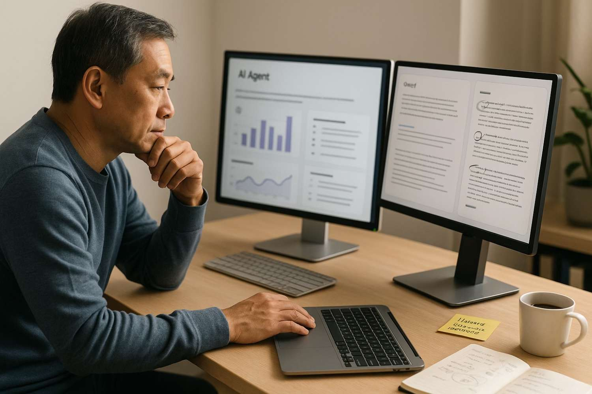

# Human Insight Remains Vital in the Expanding AI Agent Landscape

**Source:** https://www.edge8.ai/post/human-insight-ai-agents-business-landscape
**Categories:** AI in Business | AI Strategy | Operations

---

In today's rapidly evolving technological landscape, AI agents are revolutionizing how businesses operate, automate processes, and make decisions. These intelligent systems now handle everything from customer service interactions to complex data analysis with remarkable efficiency.

Yet as these capabilities expand, a crucial question emerges: what role should human insight play in an increasingly automated business environment? The answer lies not in choosing between human intelligence or artificial intelligence, but in strategically integrating both to achieve optimal outcomes.

---

## What AI Agents Can Do Exceptionally Well

Understanding where to leverage AI agents requires clear-eyed assessment of their genuine strengths:

**Pattern recognition at scale** — AI agents can analyze millions of data points simultaneously, identifying patterns and anomalies that would take humans weeks to surface. In fraud detection, quality control, and demand forecasting, this capability creates measurable business value.

**Consistent execution** — AI agents don't have bad days, don't get distracted, and apply rules identically across every case. For compliance-sensitive processes, this consistency is a feature, not just a convenience.

**24/7 availability** — customer service, monitoring, and operational tasks don't pause when humans do. AI agents extend organizational capability across time zones and outside business hours.

**Speed of synthesis** — AI agents can read and synthesize large volumes of unstructured information faster than any human, enabling better-informed decisions when time pressure is high.

---

## Where Human Insight Remains Irreplaceable

Despite AI agents' expanding capabilities, certain domains consistently require human judgment:

**Ethical judgment in novel situations** — AI agents apply rules to known patterns. When a situation falls outside their training, they either default to programmed responses or escalate to humans. Recognizing truly novel situations and reasoning through their ethical dimensions remains a human capability.

**Relationship trust and empathy** — the most important business relationships are built on trust that develops through authentic human connection. Clients, partners, and employees form different relationships with AI than with humans — and for high-stakes decisions, that difference matters.

**Strategic interpretation** — AI can surface what the data shows. Determining what it means in the context of your organization's unique history, culture, and competitive positioning requires human judgment.

**Creative leaps** — AI generates variations within known solution spaces. The truly original approaches that create category-defining advantages typically emerge from human insight.

---

## The Integration Framework

The most effective organizations don't ask "AI or humans?" They ask "which decisions and tasks are best handled by each, and how do we connect them?"

A practical integration framework:

1. **Automate** — tasks that are repetitive, rule-based, and high-volume. AI agents create efficiency without sacrificing quality.
2. **Augment** — decisions that benefit from AI's analytical power but require human judgment for final call. AI provides the analysis, humans apply context.
3. **Preserve** — relationship-building, ethical judgment, and strategic creativity. Human insight is the product, not just the process.

The organizations building this hybrid capability deliberately — rather than letting it emerge by accident — are creating workforce designs that outperform both full automation and full human models. [Contact Edge8](https://www.edge8.ai/contact) to develop your AI integration framework.
