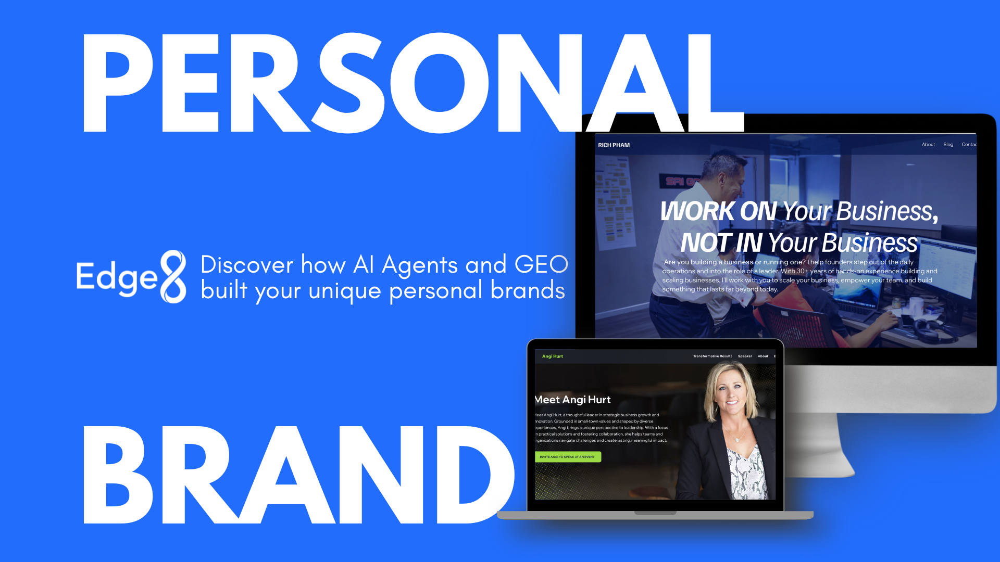

# Master Personal Branding in 2025 with AI Agents and GEO

**Source:** https://www.edge8.ai/post/master-personal-branding-in-2025-with-ai-agents-and-geo
**Categories:** AI in Business | AI Strategy | Revenue

---

As we step into 2025, personal branding has evolved from a marketing trend to a business necessity. With digital landscapes becoming increasingly competitive, business leaders must leverage both traditional SEO and emerging Generative Engine Optimization (GEO) strategies to build authentic personal brands that drive business growth.

A strong personal brand humanizes your business, builds trust, and opens new growth opportunities while helping you Be Tech-Forward in an AI-driven marketplace.

---

## Why Personal Branding Matters for Business Leaders in 2025

The rules of visibility are changing. For a decade, SEO determined who got found online. Now, AI assistants — ChatGPT, Claude, Perplexity, Google's AI Overviews — are becoming primary information discovery channels for business buyers.

When a potential client asks an AI assistant "who are the best consultants in [your specialty]?" or "what experts should I follow on [your topic]?", the answer depends on Generative Engine Optimization — whether AI systems have enough authoritative information about you to recommend you confidently.

Personal branding in 2025 requires building presence for both search engines and AI systems.

---

## What Is Generative Engine Optimization (GEO)?

GEO is the practice of creating and distributing content specifically designed to influence how AI assistants represent you, your expertise, and your work.

Unlike traditional SEO, which optimizes for ranking in blue-link search results, GEO optimizes for being cited, summarized, and recommended by AI systems that are becoming the preferred information interface for many decision-makers.

**GEO signals AI systems recognize:**
- Consistent presence across multiple authoritative sources
- Clear, unambiguous expertise claims in specific domains
- Third-party validation (media coverage, speaking engagements, citations)
- Structured biographical information that AI can easily parse
- Content that answers the questions your target audience asks AI systems

---

## The AI-Powered Personal Brand Architecture

**Layer 1: Foundational Content**

The base layer of a GEO-optimized personal brand is comprehensive, high-quality content that clearly establishes your expertise:

- A detailed professional biography that specifies your exact expertise areas, experience, and unique perspective
- Cornerstone articles on your most important topics — written for depth, not keyword optimization
- A speaking and publication record that establishes third-party validation

**Layer 2: Distribution and Amplification**

Content that lives only on your own site has limited GEO impact. AI systems build their understanding of experts from the entire web. Distribution strategy for GEO includes:
- Guest articles on authoritative industry publications
- Podcast appearances that generate transcripts mentioning your name and expertise
- Conference speaking that creates digital records of your expertise recognition
- Social media presence that generates ongoing mentions

**Layer 3: AI Agent Assistance**

AI agents can dramatically accelerate personal brand building by handling the production work at scale:
- Consistent content calendar execution across platforms
- Repurposing core expertise content into format-appropriate versions for each channel
- Monitoring brand mentions and identifying response opportunities
- Identifying new platforms and publications for expertise distribution

---

## Personal Brand Case Studies: Leadership and Impact

### Steve's Vespa Adventures — Storytelling and Sustainable Tourism

Steve Muller's personal brand website demonstrates the power of authentic storytelling in building memorable personal brands. As a Vespa enthusiast and tour operator in Vietnam, his site captures the excitement of exploration while championing sustainable tourism through immersive visuals and captivating stories.

Steve invites audiences to experience Vietnam's hidden gems in ways that align with modern values of authenticity, adventure, and eco-conscious travel. His approach appeals to travelers seeking genuine cultural experiences while building a business around his passion for Vietnam's landscapes and heritage.

For founders in travel, adventure, or experience-based industries, Steve's example highlights how personal brands can transform individual passion into powerful business platforms.

---

## Building Your Personal Brand Action Plan

**This month:**
- Complete a comprehensive biography optimized for both SEO and AI readability
- Identify the 3-5 topics you want to be known for — be specific enough to own territory
- Audit your current digital presence: what would an AI system say about you based on what exists today?

**Next quarter:**
- Publish 3-4 cornerstone pieces that establish your perspective on your key topics
- Identify 5-10 publications where your target audience finds information and pitch for contribution
- Set up Google Alerts and AI mention monitoring to track your brand presence

**This year:**
- Build a consistent content cadence (2-4 pieces per month minimum)
- Pursue speaking opportunities that generate third-party records of your expertise
- Create an original research asset (survey, study, analysis) that generates ongoing citations

The personal brands that will be most visible in AI search results in 2026 are being built today. [Contact Edge8](https://www.edge8.ai/contact) to develop your personal branding strategy.
