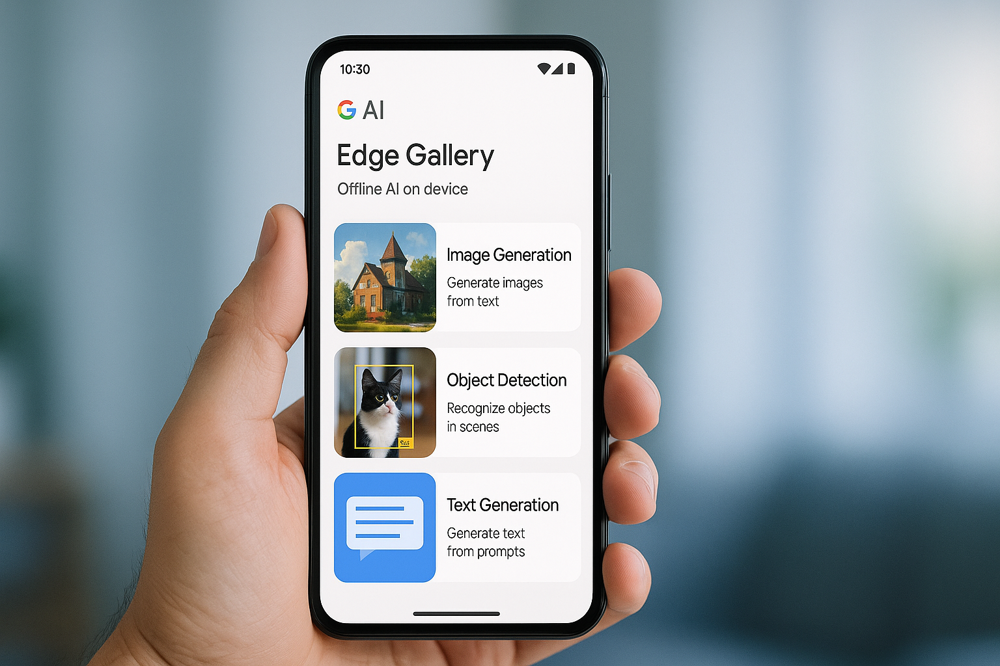

# Offline AI: Real-Time Power for Future-Ready Enterprises

**Source:** https://www.edge8.ai/post/offline-ai-real-time-enterprise-edge
**Categories:** AI in Business | Enterprise | Data Security

---

The artificial intelligence landscape just shifted dramatically. While most organizations chase cloud-based AI solutions, Google quietly launched something that changes everything: the AI Edge Gallery. This new Android application, built in partnership with Hugging Face, allows users to download and run AI models entirely on their devices — no cloud processing, no data sharing, no internet required.

What started as a consumer breakthrough has profound implications for enterprise strategy. Organizations now face a critical question: **How will offline AI capabilities reshape your competitive positioning?**

---

## The Strategic Imperative Behind Offline AI

Enterprise AI adoption has reached an inflection point. Organizations that spent years integrating cloud-based AI solutions now face unprecedented challenges around data privacy, latency, and operational resilience. The traditional model of routing sensitive business data through external servers is becoming both a competitive disadvantage and a compliance liability.

Google's AI Edge Gallery demonstrates what becomes possible when AI processing happens locally. Whether generating images, editing code, or running complex queries, everything executes on the device itself. This isn't just about technical efficiency — it's about strategic business advantage that compounds over time.

**Industry-specific implications:**
- **Financial institutions** can process transactions without exposing customer data to third-party servers
- **Healthcare organizations** can analyze patient information while maintaining complete HIPAA compliance
- **Manufacturing companies** can implement predictive maintenance without connecting critical systems to external networks
- **Legal and professional services** can work with sensitive client data without compliance risk

For organizations already managing complex data ecosystems, this shift aligns perfectly with broader data ownership strategies.

---

## Why Smart Organizations Are Embracing Offline AI Solutions

The business case for offline AI extends far beyond privacy concerns. Organizations implementing edge AI strategies report significant improvements in operational efficiency and cost management.

**Cost advantages:**
- Eliminates recurring costs associated with cloud API calls
- Especially impactful for high-volume AI operations
- One-time hardware investment replaces ongoing subscription costs

**Performance advantages:**
- Response time improvements create measurable business value
- When AI processing happens locally, applications respond instantly rather than waiting for cloud round-trips
- Critical for real-time applications: fraud detection, quality control, customer service

**Resilience advantages:**
- Operations continue during internet outages
- No dependency on third-party service availability
- Predictable performance not subject to cloud congestion

---

## Implementation Strategy for Enterprise Leaders

Successfully deploying offline AI requires a phased approach:

**Phase 1: Identify high-value, high-sensitivity use cases**
Start with workflows where both the performance benefit and data security benefit are highest. Document processing, internal knowledge base queries, and sensitive customer data analysis are natural starting points.

**Phase 2: Assess hardware requirements**
Modern offline AI models range from lightweight models running on standard laptops to larger models requiring dedicated GPU workstations. Match hardware investment to use case requirements.

**Phase 3: Build internal AI operations capability**
Offline AI requires different operational skills than cloud AI. Model management, local fine-tuning, and hardware maintenance become organizational competencies rather than vendor responsibilities.

**Phase 4: Integrate with existing workflows**
The most successful offline AI deployments connect seamlessly with existing tools and processes. Prioritize integration over capability — a well-integrated modest model outperforms a powerful isolated one.

---

## The Competitive Window

Most organizations are still building cloud-first AI strategies. The businesses that move to establish offline AI capabilities now — for appropriate use cases — will build operational advantages in data security, performance, and cost structure that are difficult to replicate quickly.

The future of enterprise AI isn't cloud vs. edge — it's knowing which workloads belong where. [Contact Edge8](https://www.edge8.ai/contact) to develop your hybrid AI infrastructure strategy.
