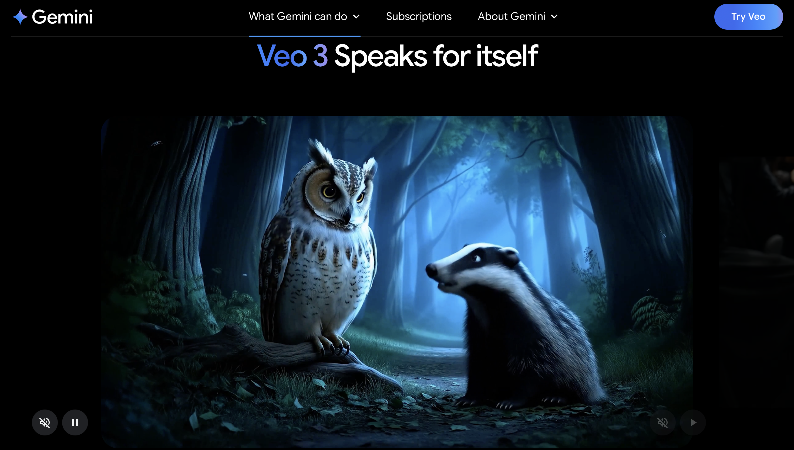

# Google's Video AI Dominance: Why VEO 3 Will Rule Visual Content

**Source:** https://www.edge8.ai/post/veo-3-video-generation-empire-youtube-data-advantage
**Categories:** AI in Business | AI Strategy | Video Technology

---

While the AI industry obsesses over model architectures and parameter counts, the real battle for video generation supremacy was decided years ago in the most unlikely place: a simple video-sharing platform called YouTube. Google's VEO 3, powered by their Gemini + Veo 3 combination, isn't just another AI model — it's the inevitable result of owning humanity's largest archive of creative expression.

The conventional wisdom suggests that AI video generation is about who can build the most sophisticated neural networks. This perspective misses the fundamental truth about artificial intelligence: **models are only as intelligent as the data that trains them.** Google doesn't just have more data than competitors — they have irreplaceable data that took decades to accumulate and cannot be replicated.

---

## The Creative Intelligence Archive

YouTube represents something unprecedented in human history: a comprehensive record of how creativity actually works. Every video uploaded since 2005 contains embedded knowledge about visual storytelling, movement patterns, camera techniques, and creative decision-making.

Consider what Gemini + VEO 3 learns from this treasure trove. When generating a video of someone walking, it doesn't rely on artificial training scenarios. Instead, it draws from millions of real walking sequences across different cultures, ages, and contexts. When creating facial expressions, it references authentic human emotions captured in genuine moments rather than staged demonstrations.

This data advantage extends beyond simple realism into sophisticated creative understanding:
- YouTube's algorithm has spent years learning what makes content engaging
- What camera angles work best for different scenarios
- How successful creators structure their narratives
- What visual patterns hold attention vs. lose it

VEO 3 inherits this accumulated wisdom, making it not just a video generator but a **creative collaborator with decades of experience.**

---

## VEO 3's Movement Mastery Advantage

One of the most challenging aspects of AI video generation is creating believable human movement. Competitors train their models on limited datasets of motion capture data or staged video sequences. Google's approach is fundamentally different — and superior.

YouTube contains billions of hours of authentic human movement across every conceivable scenario:
- People dancing at weddings
- Athletes performing under pressure
- Children playing naturally
- Professionals demonstrating skills

All captured in natural lighting conditions, from multiple angles, with the context needed to make movement meaningful rather than mechanical.

This movement authenticity translates directly into VEO 3's output quality — the subtle weight shifts, natural hesitations, and culturally specific gesture patterns that make AI-generated video feel real rather than uncanny.

---

## The Creative Feedback Loop Google Owns

Beyond raw movement data, YouTube provides something even more valuable: audience response data. Google knows exactly which visual storytelling choices engage viewers and which cause them to click away.

This engagement intelligence shapes VEO 3 at a fundamental level:
- Scene pacing that matches human attention spans
- Visual composition that draws and holds the eye
- Transition styles that feel natural vs. jarring
- Emotional beats that resonate across cultures

No competitor has access to this scale of real-world creative performance data. Building it from scratch would require decades and the kind of global platform dominance that can't be purchased or replicated quickly.

---

## What This Means for Business Video Strategy

For organizations planning their video content strategy:

**Short-term:** VEO 3 makes professional-quality video generation accessible without professional production budgets. Businesses that move quickly to integrate AI video generation will dramatically reduce content production costs.

**Medium-term:** The quality gap between AI-generated and human-produced video will narrow faster than most expect. Planning for an AI-first video workflow now prevents expensive transition costs later.

**Long-term:** As VEO 3's capabilities continue advancing on YouTube's data flywheel, early adopters will have workflow advantages that compound. Organizations building AI video competencies today will execute more sophisticated strategies tomorrow.

[Contact Edge8](https://www.edge8.ai/contact) to explore how AI video generation can transform your content strategy.
