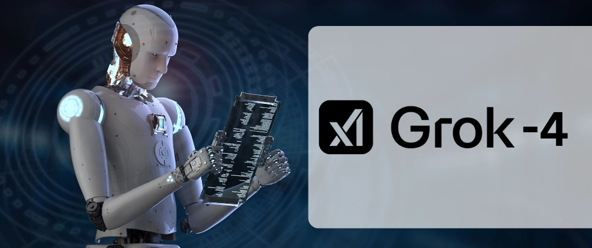

# Why Grok 4's Success Proves Strategic AI Planning Beats First-Mover Advantage

**Source:** https://www.edge8.ai/post/why-grok-4-s-success-proves-strategic-ai-planning-beats-first-mover-advantage
**Categories:** AI in Business | AI Strategy | Leadership

---

The recent launch of Grok 4 has sent shockwaves through the AI in business community, and for good reason. This breakthrough didn't happen overnight. It's the result of years of strategic planning that most observers completely missed. While ChatGPT dominated headlines for nearly a decade, Elon Musk was quietly orchestrating a masterclass in long-term strategic thinking that offers profound lessons for business leaders navigating AI adoption.

Grok 4's ability to surpass ChatGPT on the AGI index isn't just a technical achievement. It's validation of a strategic approach that prioritizes future-focused planning over immediate market entry. This represents a fundamental shift in how we should think about AI in business strategy.

---

## The Colossus Gambit: Building for Tomorrow's Reality

When Musk announced plans for [Colossus](https://x.ai/colossus) — a computer system powered by 100,000 chips — industry experts dismissed it as technically impossible. The scale seemed absurd, double what DeepSeek was attempting. Yet this wasn't reckless ambition; it was calculated preparation for inevitable technological convergence.

The lesson here transcends AI development. In business, those who Be Tech-Forward understand that building infrastructure for future capabilities often appears wasteful in the present. While competitors focused on optimizing current limitations, Musk's team prepared for the moment when computational power would catch up to their vision.

This strategic patience paid dividends. As chip technology advanced and manufacturing scaled, Colossus became not just feasible but superior to existing solutions. **The key insight: successful AI implementation requires anticipating technological trajectories, not just current capabilities.**

---

## The Twitter Acquisition: Creating Competitive Moats Through Data Strategy

The [$44 billion Twitter acquisition](https://www.edge8.ai/post/elon-musk-twitter-data-strategy-ai-play) initially appeared to be an expensive ego play. Business analysts questioned the strategic rationale, focusing on traditional social media metrics and revenue models. They missed the deeper play entirely.

Twitter represented something invaluable: the world's most curated index of human knowledge and expertise. When domain experts share insights, they typically do so on Twitter first. This creates a real-time validation layer — an opinion graph that tells AI systems not just what the internet says, but what the world's smartest people think *matters*.

For Grok's development, this data advantage proved decisive. While competitors trained on static web crawls, Grok learned from humanity's living, breathing intellectual discourse — complete with sentiment, credibility signals, and real-time relevance markers.

---

## Strategic Lessons for Business Leaders

Grok 4's ascent offers concrete lessons for any organization navigating AI adoption:

**1. Infrastructure investment precedes capability**
Don't wait for AI capabilities to mature before building the organizational infrastructure to support them. Data systems, talent, and processes take years to develop. Start now.

**2. Data moats compound**
Proprietary data advantages that seem modest today become decisive over time. The organizations building unique data assets now will be nearly impossible to displace in three to five years.

**3. Strategic patience outperforms reactive deployment**
Companies that rushed to deploy early AI tools often built on fragile foundations that required expensive rebuilds. Organizations that took time to develop thoughtful AI strategies are now deploying more effectively.

**4. First-mover advantage is temporary; strategic moats are durable**
ChatGPT's first-mover advantage in AI interfaces was real but temporary. Grok's infrastructure and data advantages represent a different kind of moat — one that deepens with time rather than eroding.

---

## The Broader Implication for AI Strategy

The Grok 4 story is ultimately about the difference between tactical and strategic thinking in AI adoption. Most organizations are playing the tactical game: evaluating current models, deploying available tools, optimizing existing workflows. This approach generates near-term value but creates no lasting advantage.

The organizations that will dominate their industries in five years are playing a different game entirely — building AI infrastructure, accumulating proprietary data, and developing organizational AI capabilities that compound over time.

The question for every business leader: are you optimizing for today's AI landscape, or building for tomorrow's reality? [Explore how Edge8 helps organizations develop AI strategies that create durable competitive advantages.](https://www.edge8.ai/contact)
