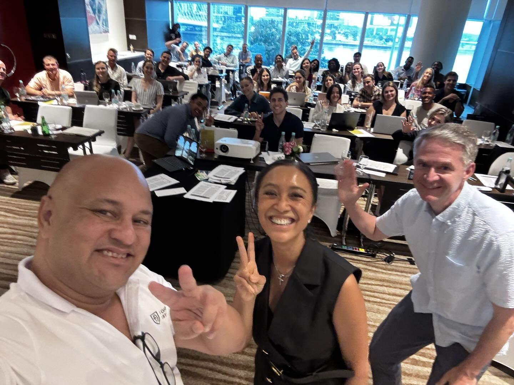

# Georgetown University MBA Students: AI Education & Cultural Intelligence in 2025

**Source:** https://www.edge8.ai/post/georgetown-university-mba-students-ai-education-cultural-intelligence-2025  
**Categories:** AI in Business | Education | Cultural Intelligence | Leadership

---

**75% of Georgetown University MBA students** studying in Vietnam identified cultural intelligence gaps as their biggest challenge when entering Asian markets. [David Hajdu](https://www.davehajdu.com), Founder and CEO of Edge8, recently addressed 40 Georgetown University MBA students alongside Dr. Brooks Holtom and lawyer Dao Nguyen, revealing critical insights about AI education's future.

The session exposed a fundamental disconnect in business education. While these brilliant minds excel at financial modeling and strategic frameworks, they face an unprecedented challenge: orchestrating artificial intelligence while building authentic relationships across dramatically different cultural landscapes.

---

## The Cultural Intelligence Crisis in Modern Business Education

Georgetown MBA students consistently raise concerns about navigating vast differences between Asian and Western business approaches. Their questions reveal more than tactical uncertainty; they expose systemic gaps in how business schools prepare leaders for global markets.

Traditional MBA programs excel at teaching analytical frameworks and strategic planning yet consistently fail to address relationship-first business cultures. Asian markets require 4–6 years of relationship building before major deals close, according to data shared during the Georgetown session. Students quickly realized this timeline represents strategic infrastructure, not inefficiency.

Dao Nguyen's legal expertise demonstrates Vietnam's innovation potential. She created the world's first legal structure allowing condominium ownership within hotel properties at Hyatt, now used globally. This breakthrough exemplifies why Vietnam serves as an extraordinary frontier for business experimentation.

Her insight stopped the room:

> "In Asia, if the mechanics of the deal are on the table before the relationship is built, the deal is already lost."

This wasn't negotiation advice — it was a fundamental truth about how trust operates in relationship-centric cultures, and a direct challenge to the transaction-first mindset most MBA programs instill.

---

## The AI Officer Imperative for Future Business Leaders

Future business leaders must become AI Officers who orchestrate both technological capabilities and cultural intelligence simultaneously. [Edge8's AI Officer certification program](https://www.ai-officer.com/ai-in-business) defines AI Officers as strategic leaders who can leverage AI tools to enhance — not replace — the human connections that drive business in relationship-first markets.

The Georgetown session made clear that the leaders who will thrive in the next decade are not those who can use AI most efficiently, but those who can use AI to become more genuinely human in their business interactions:

- Using AI-powered market research to understand cultural context *before* entering a room
- Leveraging relationship management tools to maintain meaningful connections at scale
- Applying data-driven insights to understand communication preferences without automating the communication itself
- Orchestrating AI as preparation infrastructure so that every human interaction is more informed, more authentic, and more impactful

The distinction is critical: AI handles the preparation; humans handle the relationship.

---

## Strategic AI Implementation for Cross-Cultural Success

AI Officers use artificial intelligence for enhanced preparation, not replacement of human interaction. Recommended tools include market research platforms, cultural context analysis software, and relationship management systems that support rather than automate personal connections.

Advanced analytics help Georgetown MBA students understand cultural preferences and communication styles before meetings. However, the actual work of building trust, demonstrating integrity, and creating mutual value remains fundamentally human regardless of technological advancement.

Georgetown MBA students should learn AI orchestration frameworks that enhance relationship-building capabilities. This includes using technology to maintain meaningful connections at scale while respecting cultural timing and relationship development expectations.

The most successful implementations combine data-driven insights with emotional intelligence, allowing leaders to prepare more effectively while remaining authentically present during actual interactions.

Key principles for AI-enabled cross-cultural leadership:

- **Respect relationship timelines** — AI can accelerate preparation but cannot compress trust-building
- **Use data to listen better** — analytics reveal what matters to partners before the conversation begins
- **Automate administration, not connection** — let AI handle logistics, follow-ups, and research; keep humans in every relationship moment
- **Build cultural fluency, not just cultural awareness** — AI can surface facts; only genuine engagement builds fluency

---

## The Future of Business Education and Leadership Development

The Georgetown University MBA session in Vietnam revealed more than educational gaps; it exposed an opportunity to redefine how we prepare business leaders. The future belongs to professionals who can seamlessly integrate AI capabilities with deep cultural understanding.

Business schools must evolve beyond their current frameworks to address this integration challenge. The most successful leaders of the next decade will be those who master both technological orchestration and authentic relationship building.

This isn't about choosing between efficiency and authenticity — it's about creating sustainable competitive advantages through strategic integration of both capabilities. The Georgetown students intuitively understood this balance, and their questions point toward the education transformation that's already overdue.

Ready to bridge the gap between traditional business education and AI-enabled cultural intelligence? [Explore how Edge8's AI Officer certification can transform your leadership approach](https://www.ai-officer.com/ai-in-business) and prepare you for success in global markets where relationships and technology work together, not in competition.
